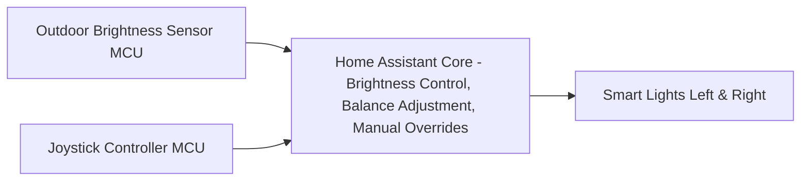

# Smart Light Automation  

A **Home Assistant project** that creates smart, human-centric, and energy-efficient lighting. The system automatically adjusts indoor lighting based on outdoor brightness and allows manual fine-tuning via a custom joystick controller.  

## Features

✔️ Energy-efficient lighting by adapting to outdoor brightness  
✔️ Human-centric lighting with colour temperature adjustments using [Adaptive Lighting GitHub Repository] (https://github.com/basnijholt/adaptive-lighting)  
✔️ User-centric lighting with manual control and balance adjustments  
✔️ Hardware integration via microcontrollers and a custom joystick remote  

---

## System Diagram



## Project Structure  

### Microcontroller Code  
- **`outdoor_brightness_meter.yaml`**  
  Reads outdoor brightness values from a microcontroller.  

- **`joystick_manual_control.yaml`**  
  Reads joystick values for manual lighting adjustments.  

### Automations  
- **`brightness_control.yaml`**  
  Dynamically sets lamp brightness based on outdoor brightness and manual adjustment values.  

- **`balance_adjust.yaml`**  
  Adjusts the balance between left and right lights based on joystick input.  
  - Balance value: `-100` to `100`  

- **`lights_manual_brightness.yaml`**  
  Enables manual brightness adjustments.  
  - Range: `-255` to `255`  

- **`joystick_button_presses.yaml`**  
  Defines actions based on button presses:  
  - **Short press** → Toggle all lights ON/OFF  
  - **Long press** → Reset manual brightness and balance values  

---

## Brightness Calculation  

**Inputs:**  
- `outdoor_brightness ∈ [0, 255]` → Outdoor light level  
- `manual_adjustment ∈ [-255, 255]` → User override  
- `left_balance ∈ [0, 1]`, `right_balance ∈ [0, 1]` → Relative balance (at least one is `1`)  

**Equations:**  
```text
total_brightness = (outdoor_brightness + manual_adjustment) mapped to [1, 255]

left_brightness  = (total_brightness * left_balance)  mapped to [1, 255]
right_brightness = (total_brightness * right_balance) mapped to [1, 255]
```

---

## Future Improvements

- Implement a **wake-up lighting feature** that gradually increases brightness in the morning.  
- Enable **automatic evening dimming** to gently reduce light levels at night.  
